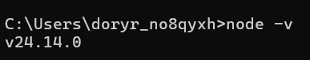
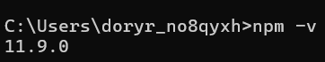
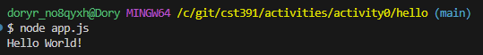
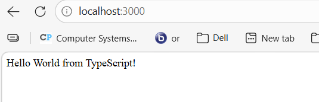
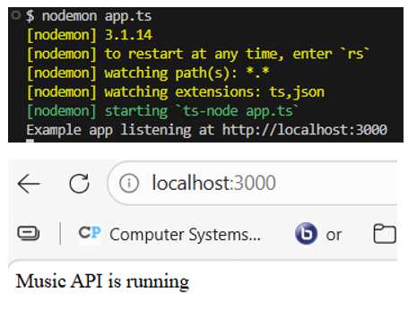
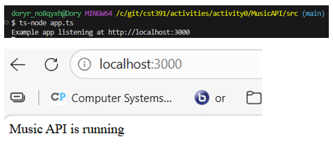
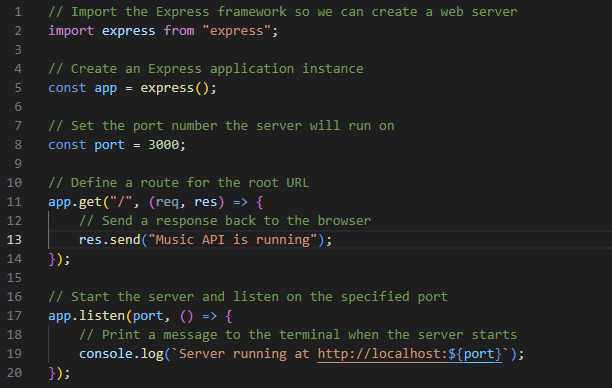

# CST-391 Activity 0


## Overview

This project demonstrates the setup and validation of a Node.js development environment.
It includes verification of Node.js and npm installations, a simple console application,
an Express web server, and a TypeScript implementation.

---

# Table of Contents

- Overview
- Technologies Used
- Environment Setup
- Project Structure
- Screenshots and Validation
- API Request Flow
- Running the Project
- Author

---

# Technologies Used

- Node.js
- npm
- Express.js
- TypeScript
- Nodemon
- Visual Studio Code

---

# Environment Setup

The development environment was validated by confirming the installation of the following tools:

| Tool | Purpose |
|-----|------|
| Node.js | JavaScript runtime |
| npm | Package manager |
| Express | Web server framework |
| Nodemon | Auto restart development server |
| TypeScript | Typed JavaScript |

---

<<<<<<< HEAD
## Project Structure
=======
# Project Structure

```
MusicAPI
│
├── src
│   └── app.ts
│
├── app.js
├── package.json
├── tsconfig.json
└── README.md
```

---

# Screenshots and Validation


---

# Screenshots and Validation

## 1. Node.js Version



*This screenshot shows the installed Node.js version using the command `node -v`. This confirms that Node.js is installed correctly.*

---

## 2. NPM Version



*This screenshot shows the installed npm version using the command `npm -v`. This verifies that the Node Package Manager is installed and working.*

---

## 3. Hello World Console Application



*This screenshot shows the simple Node.js console application running `app.js` and printing **Hello World** in the terminal.*

---

## 4. Express Hello World in Browser



*This screenshot shows the Express server running and displaying the **Hello World** message in the browser.*

URL:  
`http://localhost:3000`

---

## 5. Hello World with Nodemon



*This screenshot shows the application running using the **nodemon utility**, which automatically restarts the server when code changes are made.*

---

## 6. TypeScript Hello World in Browser



*This screenshot shows the Node.js web service written in **TypeScript** running successfully in the browser.*

---

## 7. Commented app.ts File



*This screenshot shows the `app.ts` TypeScript file with descriptive comments explaining each line of code.*

---

# API Request Flow

```mermaid
sequenceDiagram
    participant User
    participant Browser
    participant ExpressServer
    participant NodeApp

    User->>Browser: Enter http://localhost:3000
    Browser->>ExpressServer: HTTP Request
    ExpressServer->>NodeApp: Process Route
    NodeApp-->>ExpressServer: Return Response
    ExpressServer-->>Browser: Send Hello World
    Browser-->>User: Display Page
# API Request Flow

```mermaid
sequenceDiagram
    participant User
    participant Browser
    participant ExpressServer
    participant NodeApp

    User->>Browser: Enter http://localhost:3000
    Browser->>ExpressServer: HTTP Request
    ExpressServer->>NodeApp: Process Route
    NodeApp-->>ExpressServer: Return Response
    ExpressServer-->>Browser: Send Hello World
    Browser-->>User: Display Page
```

---

# Running the Project

Install dependencies:

```
npm install
```

Run application:

```
node app.js
```

Run with nodemon:

```
npm run start
```

Run TypeScript version:

```
npx ts-node src/app.ts
```

---

# Author

Doreen Rose  
Bachelor's in Software Development  
Grand Canyon University

Skills:
- Python
- Java
- JavaScript
- C#
- SQL
- Web Development
 
>>>>>>> 152ebe5 (Fix README image paths)
