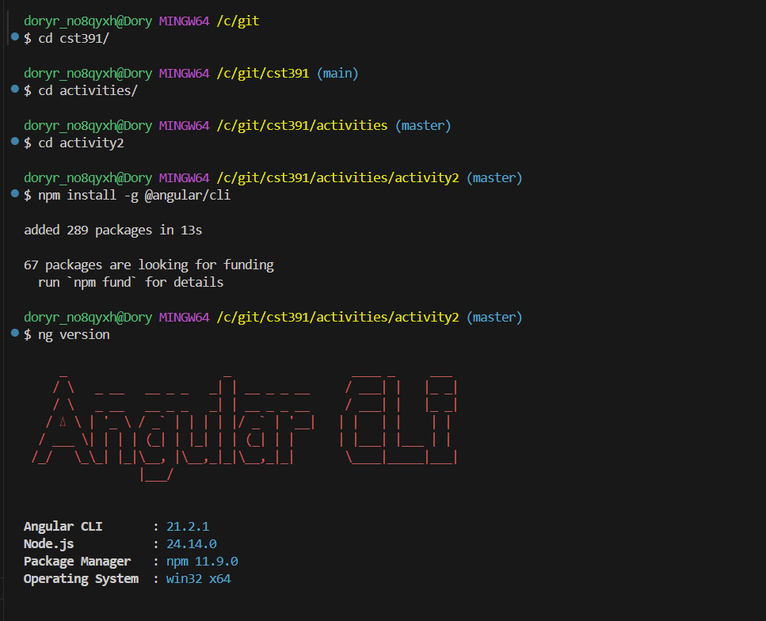
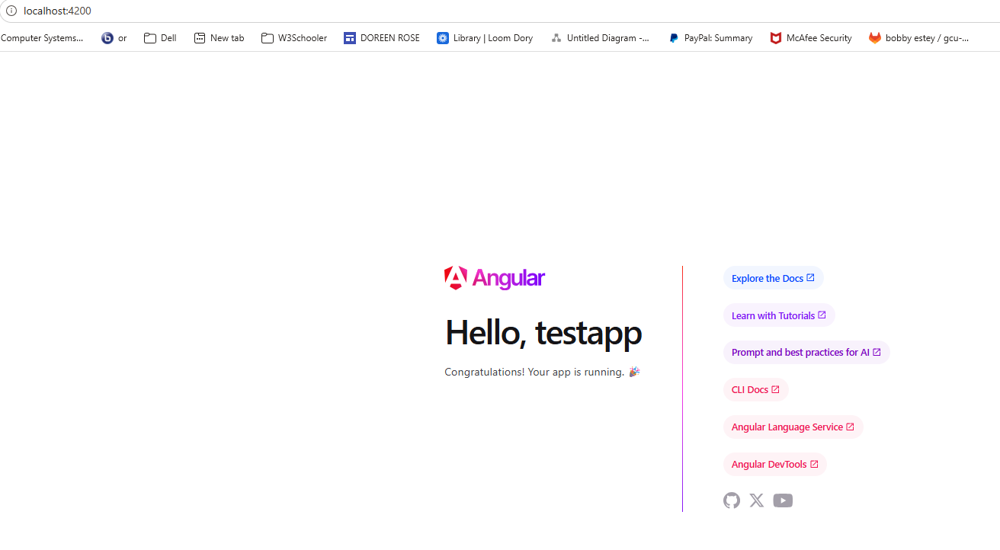
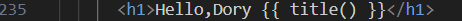
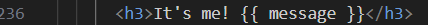
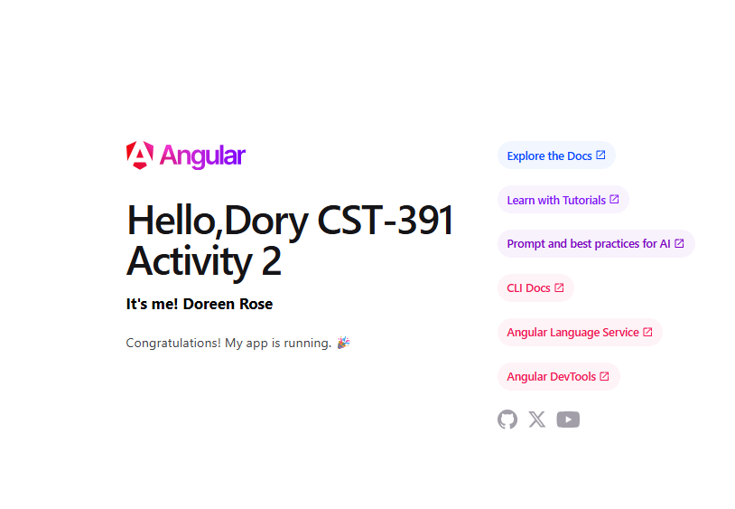
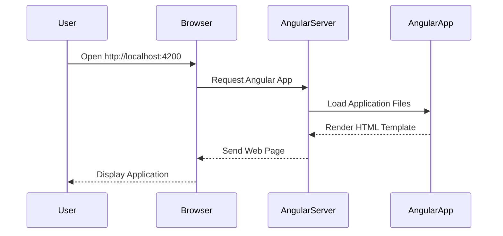

# CST-391 Activity 2


## Overview

This project demonstrates the setup and validation of an Angular development environment.
It includes installing Angular CLI, creating a test Angular application, running the
development server, and modifying the main component to display custom content.

The activity confirms that Node.js, Angular CLI, and Visual Studio Code are properly
configured for Angular web development.

---

## Table of Contents

- Overview
- Technologies Used
- Environment Setup
- Project Structure
- Screenshots and Validation
- Angular Application Flow
- Running the Project
- Author

---

## Technologies Used

- Node.js
- npm
- Angular CLI
- TypeScript
- Visual Studio Code
- Angular Framework

---

## Environment Setup

The development environment was validated by confirming the installation of the following tools:

| Tool | Purpose |
|-----|------|
| Node.js | JavaScript runtime |
| npm | Package manager |
| Angular CLI | Angular project creation and management |
| TypeScript | Typed JavaScript used by Angular |
| VS Code | Development environment |

---

## Project Structure

```
activity2
│
├── testapp
│   ├── images
│   │   ├── 1.png
│   │   ├── 2.png
│   │   ├── 3.png
│   │   ├── 4.png
│   │   └── 5.png
│   │
│   ├── src
│   │   └── app
│   │       ├── app.ts
│   │       ├── app.html
│   │       ├── app.css
│   │       ├── app.config.ts
│   │       └── app.routes.ts
│   │
│   ├── angular.json
│   ├── package.json
│   ├── tsconfig.json
│   └── node_modules
│
└── README.md
```

---

# Screenshots and Validation

## 1. Angular CLI Version



*This screenshot shows the installed Angular CLI version using the command `ng version`. This confirms that Angular CLI is installed correctly.*

---

## 2. Angular Application Running



*This screenshot shows the Angular application running in the browser after executing `ng serve -o`.*

URL:  
`http://localhost:4200`

---

## 3. Updated Title Variable



*This screenshot shows the application after modifying the title variable in the Angular component.*

---

## 4. Message Variable Added



*This screenshot shows the application displaying the new message variable added to the component.*

---

## 5. Final Browser View



*This screenshot shows the final application displaying the updated title and the student name in the browser.*

---

## Angular Application Flow



---

## Running the Project

Install dependencies:

```
npm install
```

Run the Angular development server:

```
ng serve
```

Open the application in your browser:

```
http://localhost:4200
```

The application will automatically reload whenever source files are modified.

---

## Author

Doreen Rose  
Bachelor's in Software Development  
Grand Canyon University

Skills:

- Python
- Java
- JavaScript
- C#
- SQL
- Web Development
