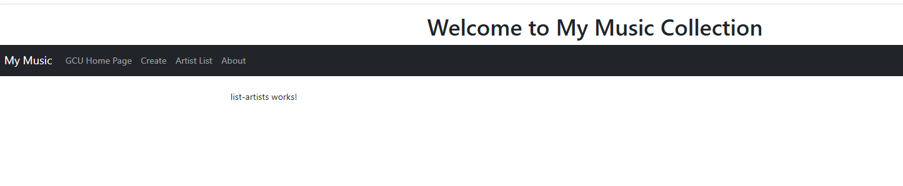
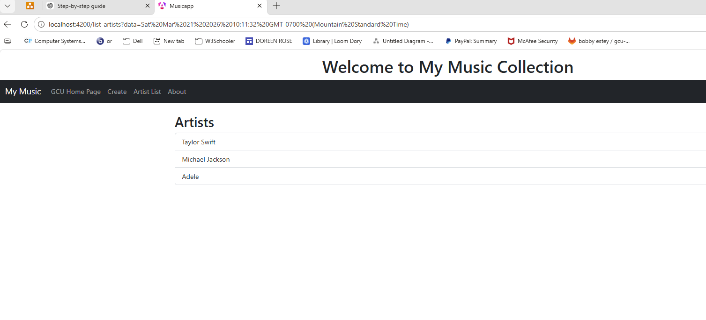
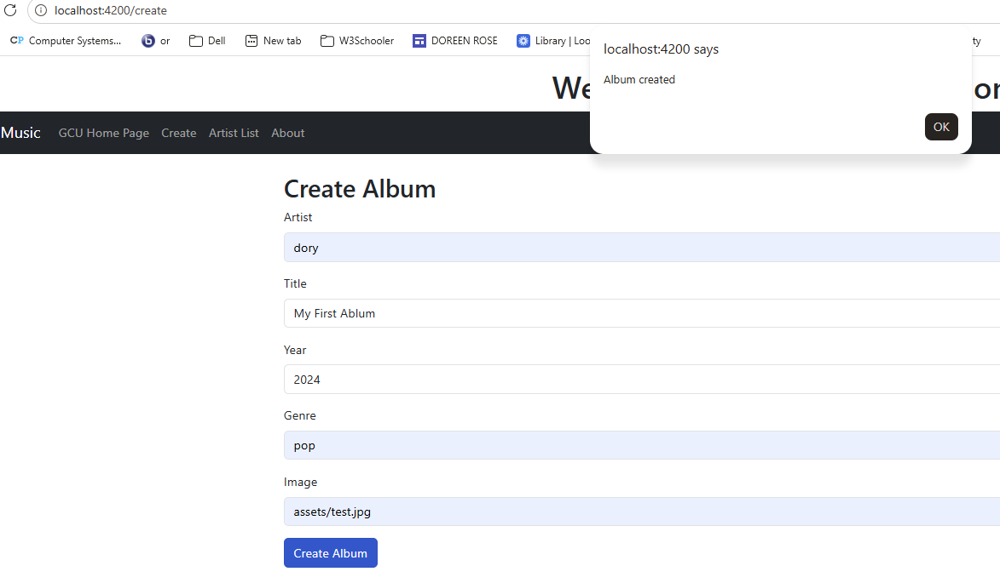
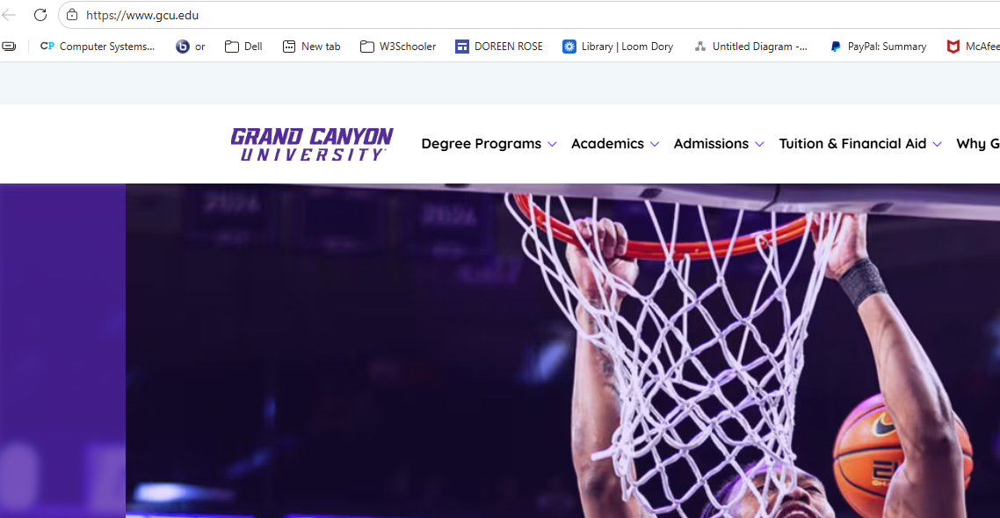

# Activity 3 – Music App (Part 2)

## Overview
In this part of the activity, I expanded the Angular application to build a Music Collection app. The application allows users to view artists, navigate between pages, and create new albums using forms and routing. Angular routing, services, and data binding were used to create a dynamic and interactive experience.

---

## Home Page
This screenshot shows the main home page with the navigation bar and welcome message.

---

## Artist List
This screenshot shows the list of artists displayed from the data service. Each artist is clickable and routes to the album list page.

---

## Create Album Page
This screenshot shows the form used to create a new album. The user can enter artist, title, year, genre, and image.

---

## External Navigation (GCU Page)
This screenshot shows navigation to an external website using the navigation bar.

---

## Features Implemented
- Angular routing with multiple pages
- Navigation bar with working links
- Dynamic artist list using *ngFor
- Query parameters passed between routes
- Form creation using [(ngModel)]
- Create album functionality
- Service to manage music data
- Navigation using routerLink and Router.navigate()

---

## Technologies Used
- Angular
- TypeScript
- Bootstrap
- HTML/CSS

---

## How It Works
- The Artist List page loads data from the MusicService
- Clicking an artist routes to the albums page using query parameters
- The Create page allows users to add a new album
- When the form is submitted, the album is added and the app navigates back to the artist list

---

## Research

### 1. Angular Routing
Angular routing allows navigation between different components without reloading the page. Routes are defined in the `app.routes.ts` file, and each path is linked to a component. This helps create a single-page application experience.

### 2. routerLink Directive
The `routerLink` directive is used in HTML to navigate between routes. It is added to elements like buttons or list items. When clicked, it changes the URL and loads the correct component without refreshing the page.

### 3. Router.navigate()
`Router.navigate()` is used in TypeScript to navigate programmatically. In this project, it is used after creating an album to redirect the user back to the artist list page. This helps control navigation through code.

---

## Conclusion
This part of the project demonstrates how Angular can be used to build a multi-page application with routing and user interaction. It shows how components, services, and navigation work together to create a functional music management app.

