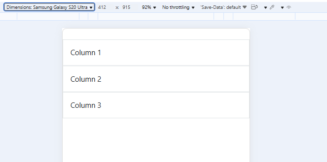
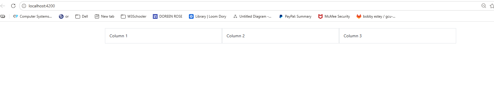
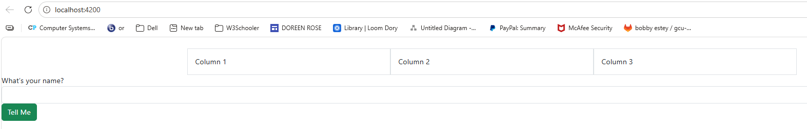
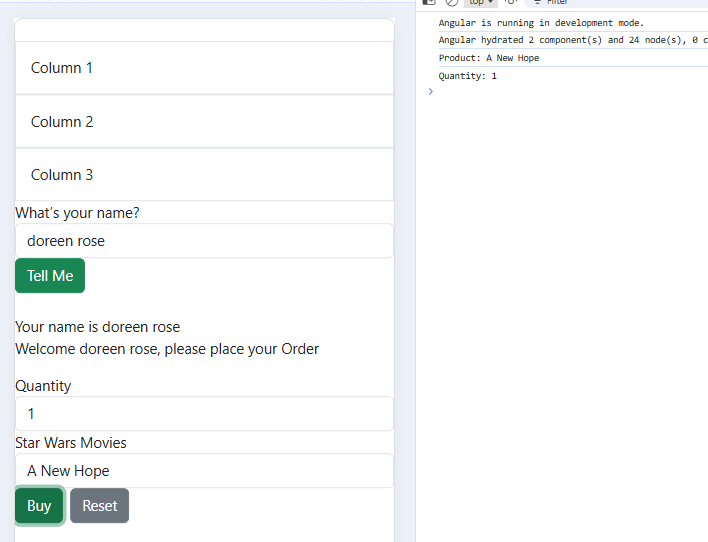

# Activity 3 – Angular Application (SimpleApp)

## Overview
In this activity, I created a simple Angular application that demonstrates responsive design, data binding, reactive forms, component communication, and user interaction. Bootstrap was used to create a responsive grid layout, and Angular features were used to handle user input and display dynamic content. This application includes multiple components (Shop and Info) that communicate using Angular features like @Input.

---

## Responsive Grid (Mobile View)
This screenshot shows the Bootstrap grid layout in mobile view. The columns stack vertically to fit smaller screens.

---

## Responsive Grid (Desktop View)
This screenshot shows the Bootstrap grid layout in desktop view. The columns are displayed side by side.

---

## Before Name Entered
This screenshot shows the application before entering a name. The Info component is not displayed because the condition has not been met.

---

## After Name Entered and Console Output
This screenshot shows the application after entering a name. The Info component is displayed, and the form allows the user to select a product and quantity. The browser console shows the selected product and quantity after submission.

---

## Features Implemented
- Bootstrap responsive grid layout  
- Angular standalone components  
- Reactive forms for user input  
- Two-way data binding  
- Conditional rendering using *ngIf  
- Component communication using @Input  
- Dropdown selection using *ngFor  
- Form submission with console output  

---

## Technologies Used
- Angular  
- TypeScript  
- Bootstrap  
- HTML/CSS  

---

## Research

### 1. @Input Decorator (info.component.ts)
The @Input decorator is used to pass data from a parent component to a child component. In this project, the Shop component sends the user's name to the Info component using @Input. This allows the Info component to display a personalized message like “Welcome [name]”. It helps components communicate and share data between each other.

---

### 2. [value] (info.component.html)
The [value] binding is used to assign a value to each option in the dropdown. In this project, it sets each option to a product from the products array. This allows Angular to know which product is selected and store it in the selectedProduct variable.

---

### 3. [(ngModel)] (info.component.html)
The [(ngModel)] directive is used for two-way data binding. It connects the input field or dropdown to a variable in the component. When the user types or selects something, the value updates automatically in the component. It also updates the UI if the variable changes. This makes handling user input simple and interactive.

---

## Conclusion
This project demonstrates how Angular can be used to build interactive and responsive web applications. It shows how components work together, how user input is handled, and how responsive design improves usability across different devices.
