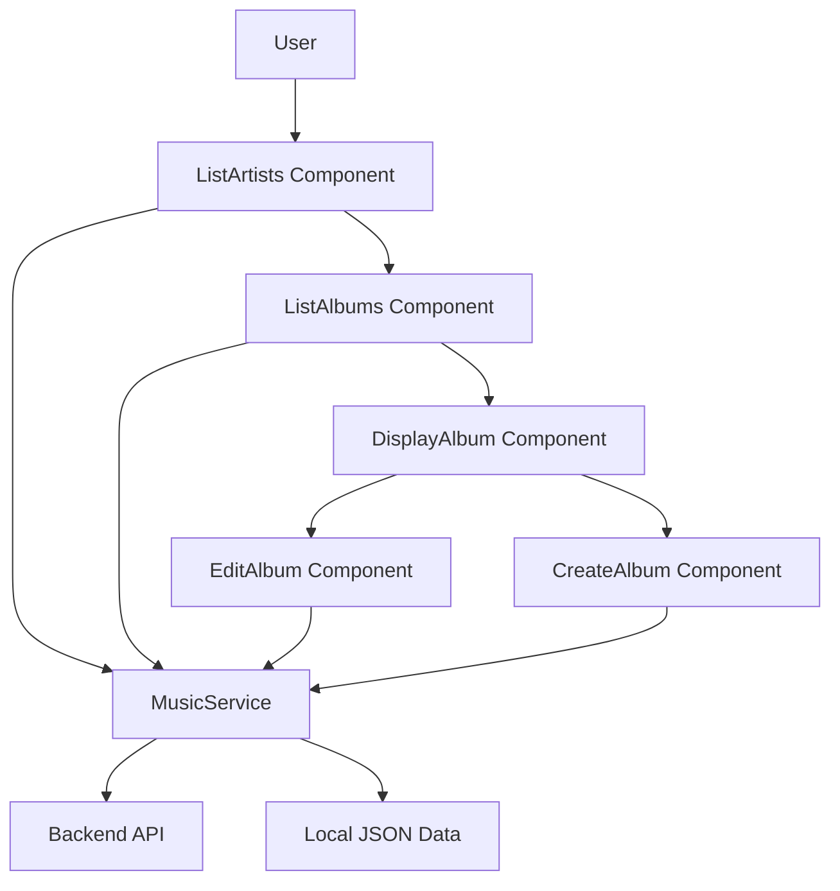
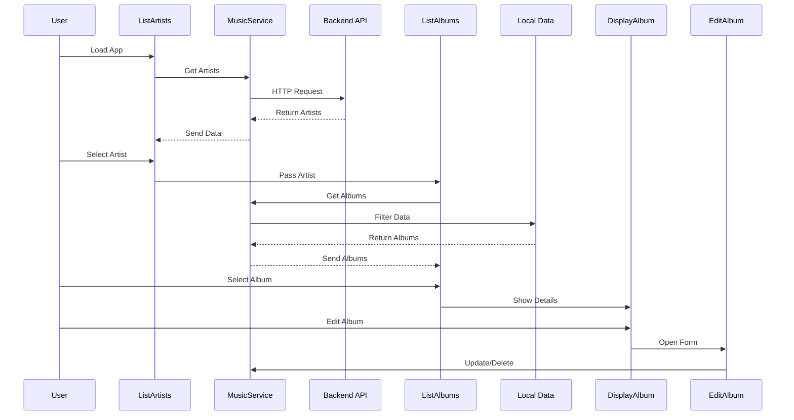
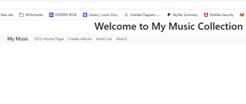
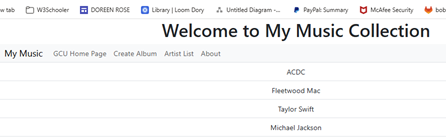
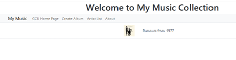
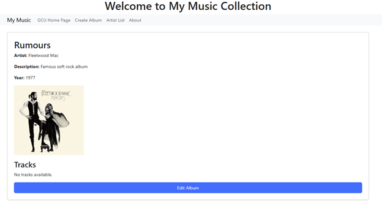
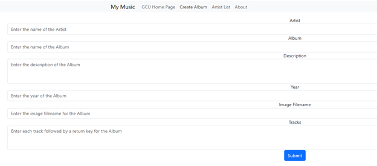
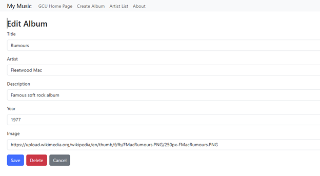

# Music Collection Application (Angular)

## Introduction
This project is a web-based music collection application developed using Angular. The purpose of this application is to demonstrate modern front-end development techniques, including component-based architecture, data binding, service-driven data management, and interaction with external APIs. The system allows users to interact with a music library by viewing artists, exploring albums, and performing CRUD (Create, Read, Update, Delete) operations. This project highlights how frontend and backend components work together to create a functional application.

---

## Overview
The application provides a user-friendly interface for managing a collection of music albums. It integrates both a backend API and local JSON data to deliver dynamic content. The system demonstrates how Angular applications communicate with services, manage state, and update the user interface in real time.

---

## Features
- View a list of artists (retrieved from backend API)
- Select an artist to display related albums
- View detailed album information:
  - Title
  - Artist
  - Description
  - Year
  - Image
  - Tracks
- Create a new album
- Edit an existing album
- Delete an album

---

## Technologies Used
- Angular (Frontend framework)
- TypeScript (Application logic)
- HTML / CSS (UI structure and styling)
- Bootstrap (Responsive design)
- Node.js (Backend API)
- JSON (Local data storage)

---

## System Architecture

The application follows a component-based architecture:

- **ListArtists Component**
  - Retrieves and displays artists from backend API
  - Handles user selection of an artist

- **ListAlbums Component**
  - Receives selected artist via @Input
  - Displays filtered album list

- **DisplayAlbum Component**
  - Shows album details
  - Provides access to edit functionality

- **CreateAlbum Component**
  - Handles form input for new albums
  - Sends data to service layer

- **EditAlbum Component**
  - Updates or deletes existing albums
  - Uses two-way binding for editing fields

- **MusicService**
  - Central service layer
  - Handles HTTP calls and local JSON operations
  - Acts as data controller between UI and data sources

---

## Architecture Diagram

---

## Data Flow

- User opens the application
- Artist list is requested from backend API
- User selects an artist
- Selected artist is passed to album component
- Albums are filtered from local JSON data
- User selects album to view details
- User can create, edit, or delete albums
- Changes are handled through the MusicService

---

## Data Flow Diagram

---

## How It Works
- Angular components communicate using **@Input and @Output**
- Data binding updates UI dynamically
- Forms use **ngModel** for two-way binding
- MusicService handles all logic and data operations
- HTTP requests retrieve data from backend API
- JSON file stores album data locally

---

## Screenshots

### Main Application Screen

### Artist List

### Album List

### Album Details

### Create Album

### Edit Album

---

## Running the Application

### Install dependencies
npm install

### Run Angular app
ng serve --o

### Run backend API
npm start

---

## Conclusion
This project demonstrates the use of Angular to build a structured, interactive web application with multiple components and services. It shows how frontend components communicate with backend APIs and local data sources to provide dynamic functionality. The architecture promotes modular design, reusable components, and clear separation of concerns. Overall, the application reflects real-world development practices and provides a strong foundation for building larger and more complex systems.

---

## Author
Doreen Rose
