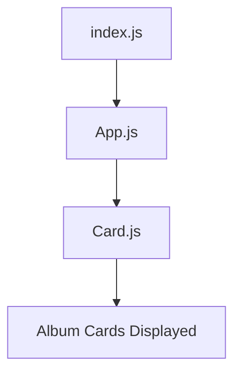
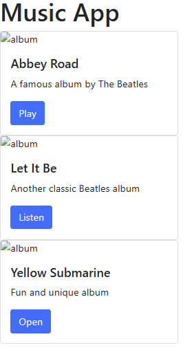
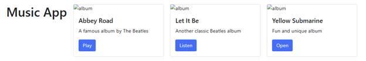
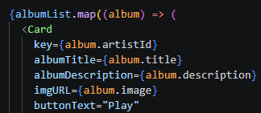

# CST-391 Activity 5 – React Music App

## Introduction
This project is a simple React music application created for CST-391 Activity 5. The purpose of this activity was to learn the basics of React development by building a user interface with JSX, custom components, props, and simple styling.

## Project Overview
The Music App displays album information using reusable card components. Each card shows an album title, description, image, and a button. Props are used so each card displays different data.

## Technologies Used
- React
- JavaScript
- JSX
- Bootstrap 5
- CSS Flexbox

## Technical Design
This application uses a component-based design:
- index.js renders the app
- App.js controls layout
- Card.js displays album data

## Application Flow (Mermaid Diagram)

## Features Added
- JSX for UI structure  
- Custom components (Card.js)  
- Props for dynamic data  
- Flexbox for layout  

## Terminology
**JSX** is a React syntax that looks like HTML but is written inside JavaScript.  
**Component** is a reusable piece of the user interface.  
**Props** are values passed from a parent component to a child component.  
**Parent component** is the main component that sends data to child components.  
**Child component** is a component that receives data from the parent.  
**Bootstrap** is a CSS library used to improve layout, buttons, spacing, and styling.  
**Flexbox** is a CSS layout method used to place items in rows and columns more easily.

## How the Application Works

The application starts in index.js, where the App component is rendered to the browser. Inside App.js, the page title and three Card components are displayed. Each Card receives values through props such as albumTitle, albumDescription, imgURL, and buttonText. The Card.js file uses those props to build a styled Bootstrap card. The App.css file uses Flexbox to display the cards in a row with spacing between them. This structure shows how React makes it easier to build reusable and organized user interfaces. The guide shows that the app should first be created in one file, then separated into Card.js and App.js, and finally styled with CSS.

## Screenshots and Captions

###  Basic React App

This screenshot shows the very first React screen after creating the app and editing index.js. The page displays the title Music App and the text My first React app, which confirms that the React application is rendering correctly in the browser.

###  First Card

This screenshot shows the first card added to the application. The page includes one Bootstrap card with an image area, album title, description, and button. This step demonstrates converting Bootstrap card markup into JSX.

###  Props Working

This screenshot shows the card after the Card component was updated to use props. The album title changed to Abbey Road, the description was customized, and the button text changed to Play. This step shows how props make the component reusable.

###  Multiple Cards

This screenshot shows the app after adding multiple Card components. The page now displays Abbey Road, Let It Be, and Yellow Submarine as separate cards with different prop values. This demonstrates component reuse.

###  Final Layout

This screenshot shows the final version of the Music App after adding App.css and using Flexbox. The album cards are arranged side by side with spacing, creating a cleaner and more professional layout.

## Conclusion
In conclusion, this activity introduced the basic structure of a React application and showed how to build a reusable user interface using JSX, components, props, and CSS. The project started with a simple page, then expanded into a music app with multiple album cards. Splitting the app into App.js and Card.js improved organization, while props made the component reusable for different albums. Bootstrap improved the visual design, and Flexbox made the layout more professional. This activity helped build a strong foundation for future React projects by showing how components work together in a clean and organized way.

## Part 2 – State and Dynamic Data

In Part 2, the application was updated to use React state. The album data was moved into a state variable called `albumList` using the `useState` hook. Instead of writing each card manually, the `map()` function loops through the album array and creates a `Card` component for each item. This made the application more dynamic and easier to update.

### Part 2 Features
- `useState` hook
- `albumList` state array
- `map()` function
- Dynamic rendering of cards
- Cleaner and more scalable code

## Terminology
**useState** is a React hook used to create and update state in a functional component.  
**map()** is a JavaScript function used to loop through an array and return a new result for each item.  
**Flexbox** is a CSS layout method used to arrange elements in rows and columns.

## Screenshots and Captions

### Final Flexbox Layout

This screenshot shows the final layout after adding `App.css` and Flexbox to display the cards side by side.

###  Part 2 State Added

This screenshot shows the updated `App.js` file after adding the `useState` hook and storing album data in the `albumList` state variable.

###  Dynamic Rendering With map()

This screenshot shows the final Music App after using the `map()` function to create cards dynamically from the album list.

## Conclusion – Part 2

In Part 2, the Music App was improved by adding React state and dynamic rendering. The album data was stored in a state variable using the useState hook, which made the application more flexible and easier to manage. Instead of manually creating each card, the map() function was used to loop through the album list and display the cards automatically. This reduced repeated code and made the application more efficient. Overall, Part 2 helped show how React can handle dynamic data and update the user interface in a simple and organized way.
