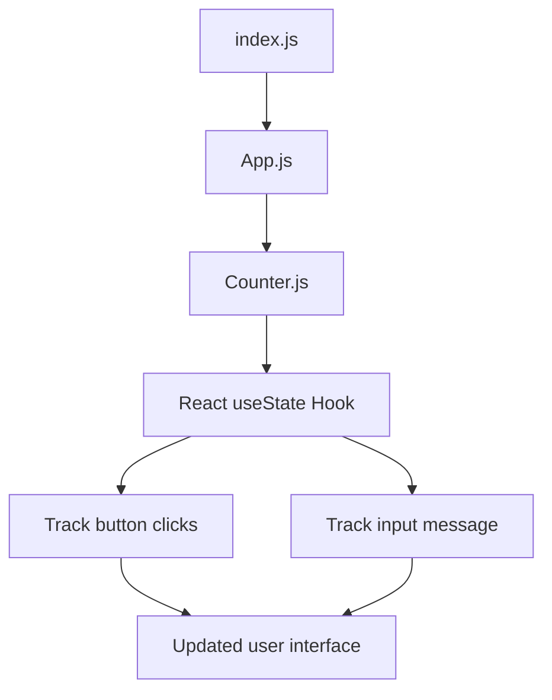
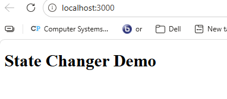
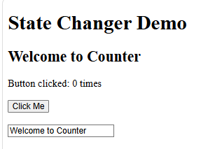
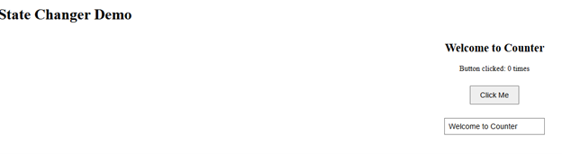

# CST-391 Activity 5 – Mini App 1 State Changer Demo

## Introduction
This project is Mini App 1 from CST-391 Activity 5. The purpose of this app was to practice React state, props, event handling, and component structure. The project uses a simple counter and text input to demonstrate how React updates the user interface when the state changes. This mini app helped show the difference between static props and dynamic state.

## Project Overview
The State Changer Demo is a small React application that displays a heading, a counter button, and a text input box. When the user clicks the button, the click count increases. When the user types in the input box, the displayed message updates right away. This project demonstrates how React uses the `useState` hook to manage changing values inside a component.

## Technologies Used
- React
- JavaScript
- JSX
- CSS
- Visual Studio Code
- npm

## Technical Design
This application uses a simple component-based structure. The `index.js` file renders the application to the browser. The `App.js` file acts as the parent component and displays the page heading and the `Counter` component. The `Counter.js` file is the child component and manages both the click counter and the input text by using the `useState` hook. The `Counter.css` file adds basic styling to improve spacing and layout.

## Application Flow (Mermaid Diagram)


## Features Added
- Functional React components
- Props passed from `App.js` to `Counter.js`
- `useState` hook for click counting
- `useState` hook for input text changes
- Button click event handling
- Input change event handling
- Basic CSS styling

## Terminology
**State** is data stored inside a React component that can change over time.  
**Props** are values passed from a parent component to a child component.  
**useState** is a React hook used to create and update state in a functional component.  
**Event handler** is code that runs when the user interacts with the page, such as clicking or typing.  
**Controlled component** is a form element, like an input, whose value is controlled by React state.

## File Structure
```text
statechanger/
├── src/
│   ├── index.js
│   ├── App.js
│   ├── Counter.js
│   └── Counter.css
└── package.json
```

## How the Application Works
The application begins in `index.js`, where the `App` component is rendered to the browser. Inside `App.js`, the page title and the `Counter` component are displayed. The `Counter` component receives a title prop from the parent. It then uses two `useState` hooks. One state variable stores the number of button clicks, and the other stores the message shown on the screen and inside the input box. When the button is clicked, the click count increases by one. When the user types in the input box, the message updates live on the page. This shows how React state automatically updates the interface.

## Screenshots and Captions

###  Basic App Setup


The first version of the State Changer Demo after creating the React app and displaying the main heading in the browser.

###  Counter Component Added


 The app after adding the `Counter` component. The screen displays the welcome message, the click counter, the button, and the input box.

### Styled Final Layout


The final version of the mini app after adding CSS styling. The page includes the heading, counter, button, and input field with updated spacing and layout.

## Conclusion
In conclusion, this mini app introduced the main ideas behind React state management. It showed how props can pass starting data into a component and how state can change when the user clicks a button or types into an input field. The project also reinforced the use of component structure and CSS styling. This app created a strong foundation for understanding how React handles dynamic user interfaces.
