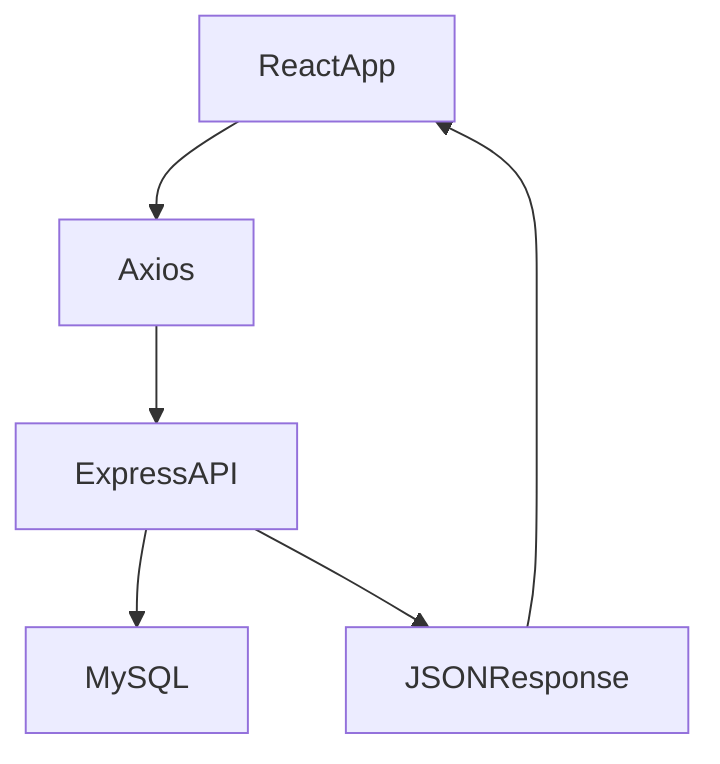
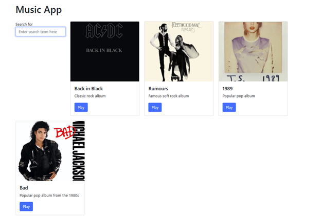
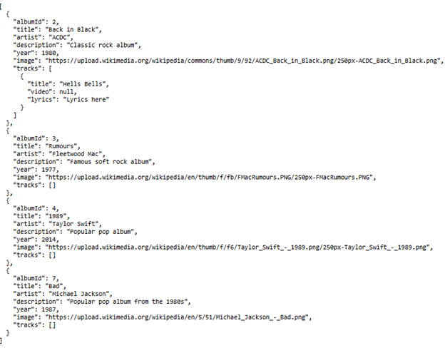
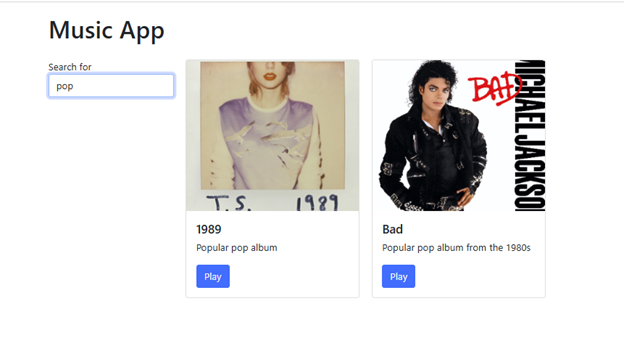
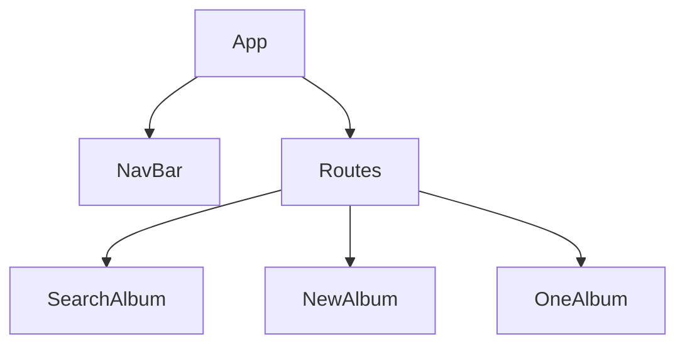
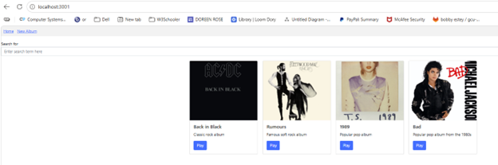
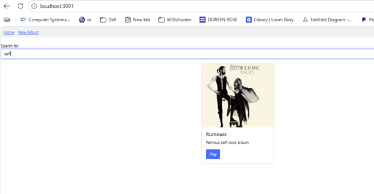
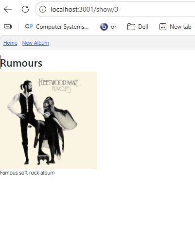

# CST-391 Activity 6 – React Music App

## Part 3 – External Data Source and Search

### Overview
In this part of the activity, the music application was updated to use an external data source instead of local JSON data. Axios was introduced to retrieve album data from a REST API built with Express. A search feature was also added to allow users to filter albums dynamically.

### Technologies Used
- React
- Axios
- Node.js / Express
- REST API
- JavaScript
- useEffect Hook

### Technical Design
- dataSource.js handles API calls using Axios  
- App.js loads data using useEffect  
- SearchForm.js handles user input  
- Album data is retrieved from Express backend  

### Application Flow (Mermaid Diagram)

### Features Added
- External data fetching using Axios  
- REST API integration  
- Search functionality  
- useEffect for side effects  

### Terminology
**Axios** is a library used to make HTTP requests to a server.  
**REST API** is a service that allows applications to communicate using HTTP requests.  
**useEffect** is a React hook used to perform side effects such as data fetching.  
**Asynchronous** means code runs without blocking other processes.  

### Screenshots and Captions

**Figure 1: Music application displaying album list retrieved from external REST API**  
Shows the music application loading album data from the backend server. Each album is displayed using a card component with title, description, image, and action button. This demonstrates successful integration between the React frontend and Express API.

**Figure 2: Express REST API returning album data in JSON format**  
Shows the backend API response at the `/albums` endpoint. The data is returned in JSON format and includes album details such as title, artist, description, and image. This demonstrates how the frontend retrieves data from an external service.

**Figure 3: Music application search feature filtering albums based on user input**  
Shows the music application after a search term is entered. The application filters the album list dynamically and displays only matching results. This demonstrates the use of React state and props to control data rendering.

### Conclusion – Part 3
In Part 3, the application was enhanced by connecting it to an external REST API using Axios. The useEffect hook was used to load data when the component renders. A search feature was added to improve user interaction. This part demonstrated how React applications can work with backend services and handle asynchronous data.

---

## Part 4 – Navigation Routing (Music App)

### Overview
In this part, React Router was implemented to allow navigation between multiple pages in the music application. New components were added to organize the application and improve structure.

### Technologies Used
- React Router DOM
- React Components
- JavaScript

### Technical Design
- App.js manages routing  
- NavBar.js handles navigation  
- SearchAlbum.js combines search and album list  
- AlbumList.js displays albums  
- OneAlbum.js shows album details  
- NewAlbum.js is a placeholder  

### Application Flow (Mermaid Diagram)

### Features Added
- Routing using BrowserRouter  
- Navigation between pages  
- Dynamic routing with parameters  
- Component-based structure  

### Terminology
**Routing** connects a URL path to a component.  
**BrowserRouter** enables navigation using URL paths.  
**Route** defines a page in the application.  
**Dynamic Route** allows passing parameters in the URL.  

### Screenshots and Captions

**Figure 4: Music application home page with routing and navigation enabled**  
Shows the main page of the music application with navigation links and album list displayed. This demonstrates the use of React Router to manage page navigation and organize components within the application.

### Search Results Page

**Figure 5: Music application search results filtered through user input during routed navigation**  
Shows the music application after the user entered the word “soft” in the search field. The application filtered the album list and displayed only the matching result, “Rumours.” This demonstrates how the search feature works together with the routed application structure to provide dynamic filtering and organized navigation.

**Figure 6: Music application album detail page displayed through dynamic routing**  
Shows the album detail page after selecting an album. The application uses dynamic routing to pass the album ID and display detailed information. This demonstrates how React Router handles parameterized routes..

**Figure 7: New Album page displayed as a placeholder within the routed application**  
Shows the New Album page accessed through navigation. This page is currently a placeholder and will be fully implemented in a later activity. This demonstrates how routing is used to prepare future application features.

### Conclusion – Part 4
In Part 4, routing was added to the music application to allow navigation between different pages. The application structure was improved by breaking it into smaller components. React Router made it possible to create a more dynamic and user-friendly experience.
