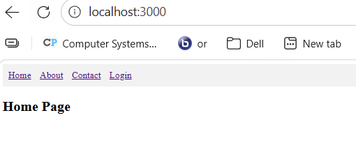
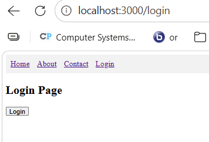
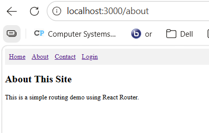
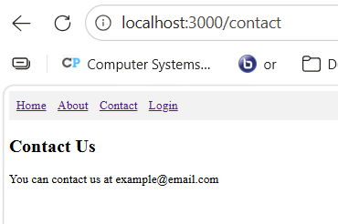

## Mini App – Routing Demo

### Overview
A separate routing demo application was created to demonstrate how React Router works with multiple pages and protected routes.

### Technologies Used
- React Router DOM
- React Hooks

### Features
- Navigation between pages  
- Login system simulation  
- Protected routes using PrivateRoute  
- Redirect after login  

### Terminology
**Private Route** restricts access to certain pages unless logged in.  
**Navigate** is used to redirect users to another page.  
**useNavigate** is a hook used for navigation.  

### Screenshots and Captions

### Home Page

**Figure 1: Home page demonstrating client-side navigation using React Router**  

This screenshot shows the default landing page of the routing application. The navigation bar contains links to different routes, allowing users to move between pages without reloading the browser. This demonstrates how React Router enables seamless client-side navigation.

**Figure 2: Login page used to authenticate users before accessing protected routes**  
This screenshot shows the Login page that appears when a user attempts to access a protected route. The page includes a login button that simulates authentication and allows access to restricted content. This demonstrates how user authentication is handled in a React application.

**Figure 3: About page accessed after successful login through protected routing**  
This screenshot shows the About page, which is protected by a PrivateRoute component. Users must be authenticated before accessing this page. After login, the user is redirected to the originally requested route, demonstrating controlled access and navigation flow.

### Contact Page

**Figure 4: Contact page displayed after successful authentication using protected routing**  
This screenshot shows the Contact page, which is also protected by a PrivateRoute component. The page becomes accessible only after login, demonstrating how restricted routes prevent unauthorized access and ensure proper navigation control.

### Conclusion – Routing Demo
The routing demo showed how React Router can be used to control navigation and protect routes. It also demonstrated how login flow works using state and navigation hooks.

---

## Conclusion
In Activity 6, the music application was significantly improved by adding external data integration and routing. Axios allowed the app to retrieve data from a backend service, while React Router enabled navigation between multiple pages. These features made the application more dynamic, scalable, and closer to real-world web applications.
