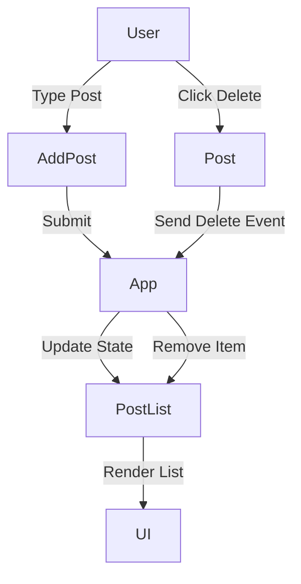
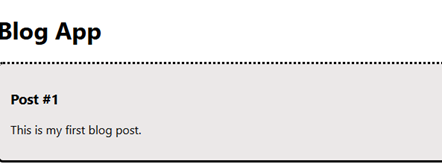
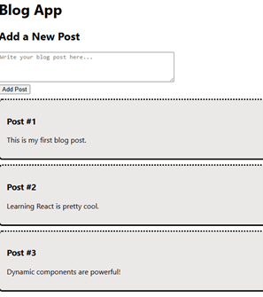
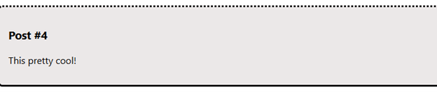
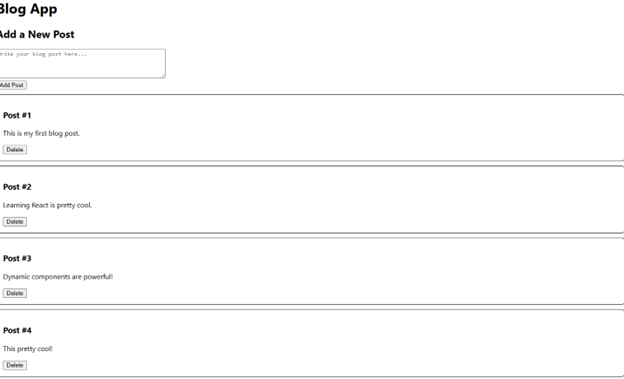
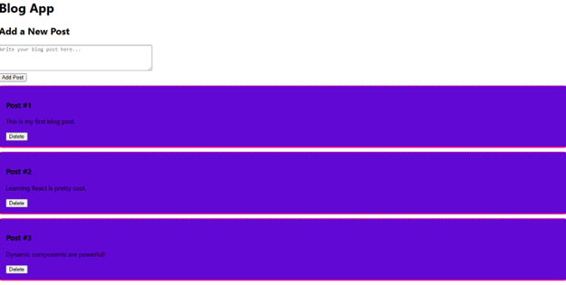

# 🚀 CST-391 Activity 7 – Dynamic Components Demo (OVERKILL VERSION)

## 👨‍💻 Author
Doreen Rose  
Grand Canyon University  
CST-391  

---

## 📌 Project Overview
This project demonstrates the implementation of **dynamic components in React** through a fully interactive Blog application. The system allows users to add and remove posts in real time, showcasing React’s ability to efficiently manage and update UI state without requiring page reloads.

---

## 🛠️ Tech Stack
- React (Create React App)
- JavaScript (ES6+)
- HTML5 / CSS3
- Node.js / npm

---

##  Full System Interaction



---

## ⚙️ Core Features

### 📝 Add Post
- Controlled component using `useState`
- Real-time input tracking
- Adds new posts dynamically using spread operator

### ❌ Delete Post
- Removes posts using `filter()`
- Callback function passed via props
- Immediate UI update

### 🔄 Dynamic Rendering
- Uses `map()` to render components
- State-driven UI updates
- No page refresh required

---

## 🧠 Key Concepts Demonstrated

| Concept | Explanation |
|--------|------------|
| Functional Components | Modular UI built using JavaScript functions |
| Props | Data passed from parent to child components |
| useState | React hook for managing dynamic state |
| map() | Renders lists dynamically |
| filter() | Removes elements from state |
| Controlled Components | Form inputs tied to state |

---

## 📸 Screenshots (REQUIRED FOR SUBMISSION)

### 📸 Screenshot 1 – Initial Blog App Display

**Description:** The initial rendering of the Blog application displaying a single Post component. This demonstrates the foundational structure of a React functional component and how data is passed using props from the parent component to a child component for display.

---

### 📸 Screenshot 2 – Multiple Posts (map function)
 
**Description:** Multiple blog posts rendered dynamically using the map() function. The application stores post data in state and iterates over the array to generate reusable Post components, demonstrating efficient list rendering and component reuse in React.

---

### 📸 Screenshot 3 – Add Post Feature

**Description:** A new blog post successfully added through a controlled input form. The form uses React state to manage user input in real time, and the application updates the post list dynamically using the spread operator without requiring a page refresh.

---

### 📸 Screenshot 4 – Delete Feature

**Description:** The Delete functionality removes individual posts from the list using an event handler passed from the parent component. The state is updated using the filter() method, demonstrating how React efficiently handles data changes and re-renders the UI accordingly.

---

### 📸 Screenshot 5 – Dynamic Interaction
 
**Description:** The application demonstrating full dynamic interaction, including adding and removing posts, real-time state updates, and component re-rendering. This highlights how React manages dynamic content through state and props, enabling a responsive and interactive user experience.

---

## 🚀 How to Run

```bash
npx create-react-app blog
cd blog
npm start
```

---

## 📊 Summary
This project highlights how React efficiently manages dynamic content using state and component-based architecture. By combining `useState`, `map()`, and `filter()`, the application delivers a responsive and interactive user experience.

---

## 📈 Future Enhancements
- Add persistent storage (database or localStorage)
- Implement edit functionality
- Add user authentication
- Improve UI/UX with styling frameworks

---

## 🧠 What I Learned
This activity strengthened my understanding of how React handles dynamic data and component re-rendering. I gained hands-on experience with state management, event handling, and building interactive user interfaces that respond instantly to user input.

---

## ✅ Status
✔ Complete  
✔ Fully Functional  
✔ Meets All Assignment Requirements  
✔ Portfolio Ready  

---
