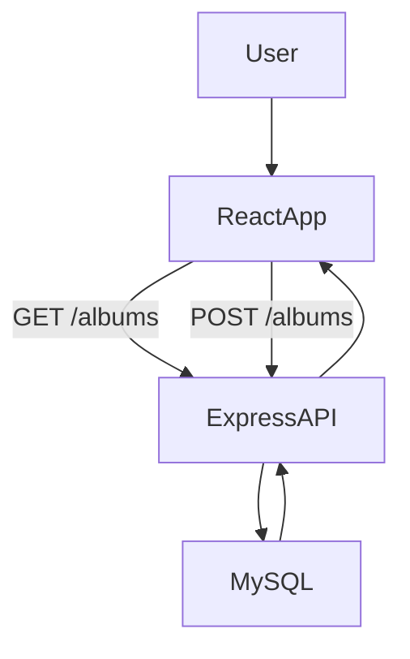
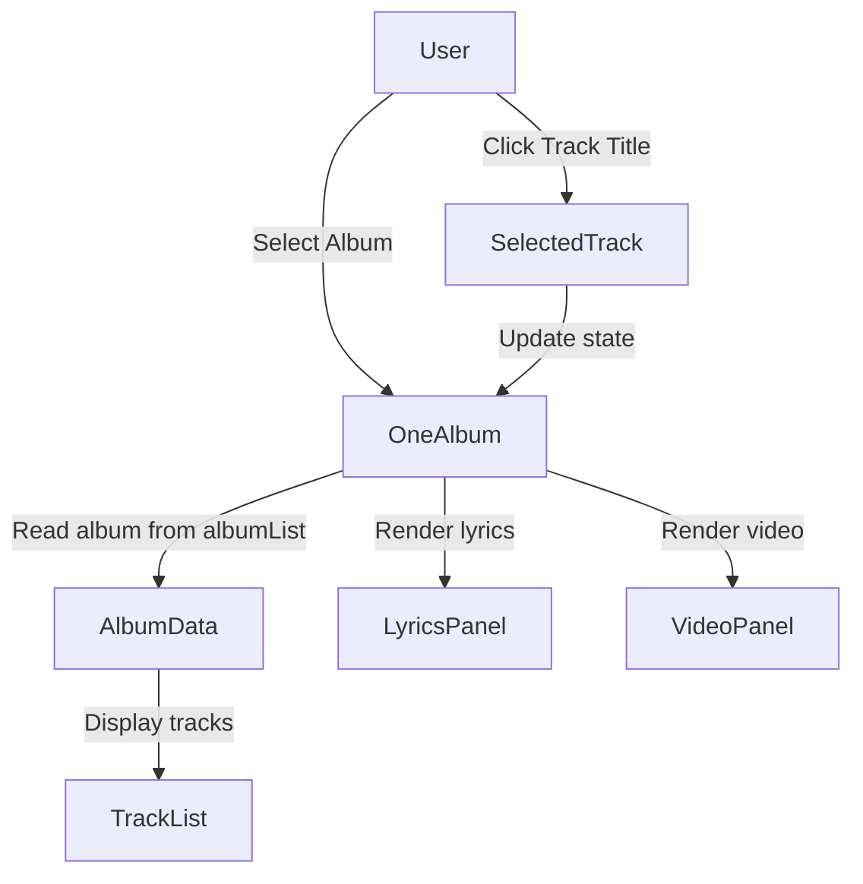
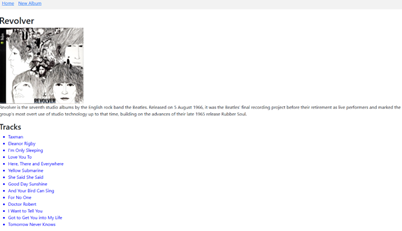
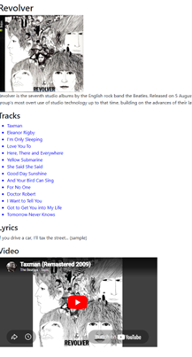
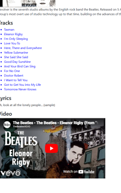
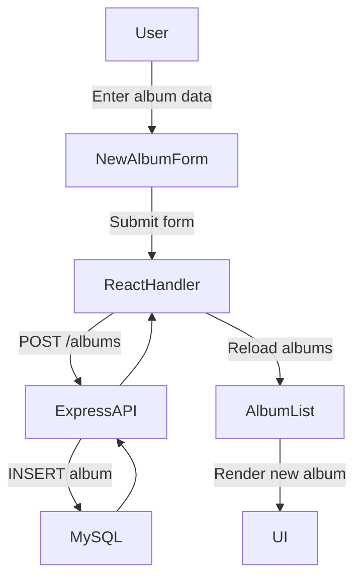
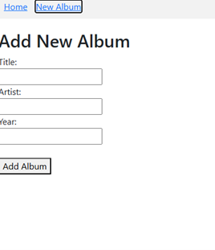
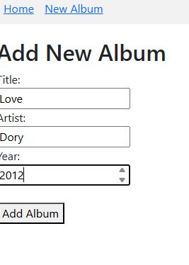
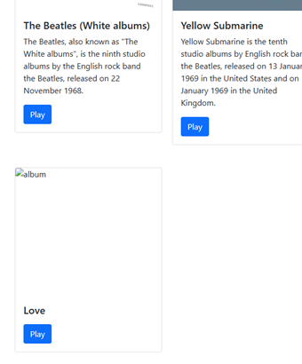

# 🎵 Music Album Application – Activity 7

## 📌 Overview
This activity demonstrates a full-stack music album application built with a React frontend, an Express backend, and a MySQL database. In this phase of the project, the application was enhanced to support dynamic album details in `OneAlbum` and album creation through a controlled React form. Together, these features demonstrate state management, conditional rendering, API integration, and database persistence.

---

## 🧱 System Architecture

System architecture showing communication between the React frontend, Express backend API, and MySQL database for retrieving and creating album data.

---

# 🧩 Part 5 – Dynamic Album Details

## 🔍 Description
Part 5 focused on enhancing the `OneAlbum` component so users could view album details and interact with track data. This included rendering a list of tracks, selecting an individual track, and dynamically displaying that track’s lyrics and embedded video.

---

## ⚙️ Features Implemented
- Display of album title, image, and description
- Dynamic rendering of album tracks
- Track selection with `useState`
- Conditional rendering of lyrics
- Conditional rendering of embedded video
- Backend integration to retrieve tracks with album data

---

## 🗺️ Part 5 Data Flow

  
Data flow for Part 5 showing how the `OneAlbum` component loads album information, displays tracks, and updates the interface when a user selects a track.

---

## 📸 Screenshots

### Screenshot 1 – Album Page with Tracks Visible

 
The `OneAlbum` page displaying album details including the title, cover image, description, and dynamically loaded track list. This confirms that album and track data were successfully retrieved from the backend and rendered in the React interface.

---

### Screenshot 2 – Track Selected with Lyrics and Video

 
A selected track displayed with its associated lyrics and embedded video. This demonstrates the use of React state and conditional rendering to dynamically update the user interface based on user interaction.

---

### Screenshot 3 – Dynamic Track Interaction

 
The application responding dynamically to track selection by updating the displayed content in real time. This verifies that the track list is interactive and that the selected track drives the lyrics and video panels.

---

## 🧠 Part 5 Summary
Part 5 enhanced the album details experience by making the `OneAlbum` component interactive. Track data was loaded from the backend, rendered dynamically in the interface, and tied to user events so that selecting a track updated the visible lyrics and video content. This part demonstrated React state management, event handling, conditional rendering, and backend-to-frontend data integration.

---

# ➕ Part 6 – Create New Album

## 🔍 Description
Part 6 focused on replacing the placeholder New Album page with a working form that allows users to add albums to the system. The form was implemented using controlled components and connected to the backend API with a POST request. Submitted albums were persisted to the MySQL database and then displayed back in the application.

---

## ⚙️ Features Implemented
- Controlled form fields using `useState`
- Real-time updates using `onChange`
- Form submission handling with `onSubmit`
- POST request to backend API
- MySQL database insertion
- Automatic frontend refresh after save
- Navigation back to the album list after creation

---

## 🗺️ Part 6 Submission Flow

 
Form submission flow for Part 6 showing how the React form sends album data to the Express API, stores it in MySQL, and reloads the updated album list in the interface.

---

## 📸 Screenshots

### Screenshot 4 – New Album Form

 
The New Album page displaying a controlled React form with fields for album title, artist, and year. Each input is connected to component state using the `useState` hook.

---

### Screenshot 5 – Completed Form Before Submission

 
The New Album form populated with user-entered data prior to submission. This demonstrates the use of controlled components and real-time form state management in React.

---

### Screenshot 6 – New Album Successfully Added

 
The newly created album displayed in the application after form submission. This confirms successful API communication, database persistence, and frontend refresh following the POST request.

---

## 🧠 Part 6 Summary
Part 6 implemented full-stack album creation by connecting a controlled React form to the backend API and MySQL database. User input was captured through component state, submitted with a POST request, saved to the database, and then reflected back into the user interface. This part demonstrated real-world CRUD functionality and strong frontend-backend-database integration.

---

# 🛠️ Technologies Used
- React
- React Router
- Axios
- Node.js
- Express
- MySQL
- JavaScript
- CSS

---

# 🏁 Final Outcome
Parts 5 and 6 together demonstrate a working full-stack music application that supports both dynamic data presentation and data creation. The project now allows users to explore album content interactively and add new albums to persistent storage, reflecting core modern web development practices.
