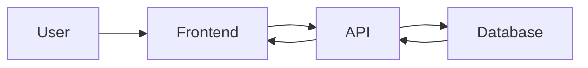
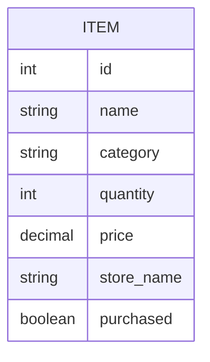
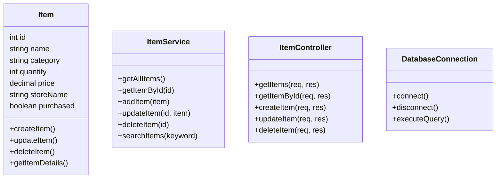
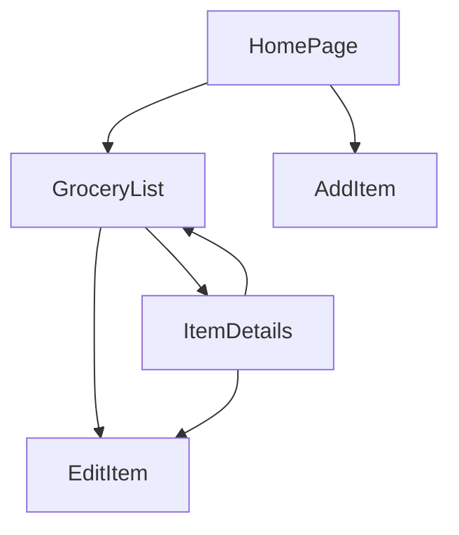
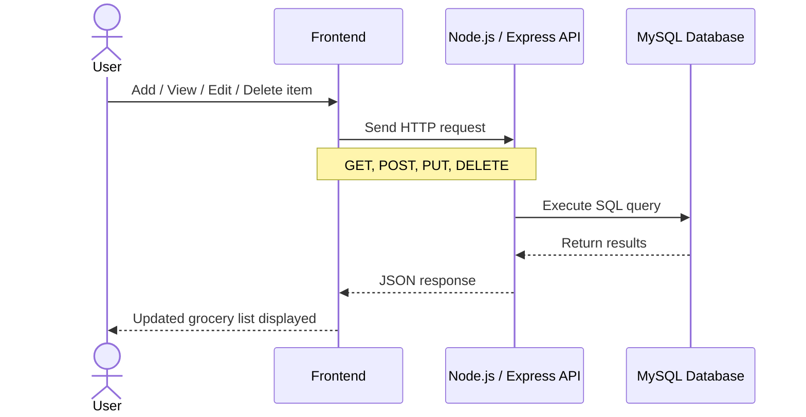

# 🛒 SmartCart Grocery Planner

## Milestone 2: Refined Project Proposal

**Course:** CST-391 JavaScript Web Application Development  
**Author:** Doreen Rose  
**Date:** March 15, 2026  

---

## Introduction

SmartCart Grocery Planner is a simple full-stack web application that helps users manage their grocery shopping list. Users can add, edit, delete, and search grocery items while organizing them by category.

This project demonstrates how a modern web application connects the **frontend, backend, and database** into one working system.

---

## Instructor Feedback

> Doreen, please move this document to Markdown. A kind reminder, we are no longer using Office for anything. All documentation is Markdown. Once you have performed this task, send me the markdown link in Halo messenger and I will update your grade. Thanks.
>
> Doreen, excellent work on this assignment. Minor stuff:
>
> - Milestone is misspelled
> - Never put spaces in files; change `milestone 1` to `milestone1`
> - Spaces cause a lot of issues down the road and should be avoided

---

## How Feedback Was Addressed

I addressed the instructor feedback by converting the original proposal into Markdown format. I also corrected the spelling of the word **Milestone** and removed spaces from file and folder names to follow better naming practices. For example, I changed `milestone 1` to `milestone1`. In addition, I refined and improved the original Milestone 1 proposal by expanding the project requirements, adding more detail to the database design, including a UI sitemap and wireframes, improving the UML class descriptions, and introducing a REST API section that follows REST conventions.

---

## 📚 Course Information

**Course:** CST-391 JavaScript Web Application Development  
**Author:** Doreen Rose  
**Date:** March 15, 2026  

---

## 🚀 Project Overview

SmartCart Grocery Planner allows users to track grocery items they need to purchase. The goal is to build a simple but complete web application that demonstrates how data flows between a client interface, server API, and database.

The application will be built twice to compare modern frontend frameworks:

- Angular
- React

---

## 🧰 Technology Stack

### Development Tools

- Visual Studio Code
- GitHub
- Node Package Manager (NPM)

### Backend

- Node.js
- Express.js
- REST API
- MySQL Database

### Frontend

- Angular
- React

---

## 🏗 Application Architecture



**Explanation**

1.  The user interacts with the frontend interface.
2.  The frontend sends requests to the Node.js Express API.
3.  The API communicates with the MySQL database.
4.  Data is returned to the frontend and displayed to the user.

---

## 📁 Project Structure

```text
SmartCart-Grocery-Planner
│
├── backend
│   ├── controllers
│   ├── routes
│   ├── dao
│   └── app.js
│
├── frontend-angular
│
├── frontend-react
│
├── database
│   └── schema.sql
│
└── README.md
```
---
## 📡 REST API Design

### API Entry Points

|Method|Endpoint|Description|
|--|--|--|
|GET|/items|Get all grocery items|
|GET|/items/:id|Get one grocery item|
|POST|/items|Add a new grocery item|
|PUT|/items/:id|Update an item|
|DELETE|/items/:id|Delete an item|

---

## 🗄 Database Design



### Product Table

|Field|Type|Description|
|----------|-------------|---------------------------------------------|
|id|INT|Unique item ID|
|name|VARCHAR(100)|Name of the grocery item|
|category|VARCHAR(50)|Grocery item category|
|quantity|INT| Quantityneeded|
|price DECIMAL(10,2)|Estimated item price|Estimated item price|
|store_name|VARCHAR(100)|Store where the item will be purchased|
|purchased|BOOLEAN|Indicates whether the item has been purchased|


---


## UML Class Diagram


## UI Sitemap


----
### What this diagram shows
- **ItemController** handles API requests
- **ItemService** contains business logic
- **Item** represents the data model
- **DatabaseConnection** communicates with MySQL

---
## 👤 User Stories

- As a user, I want to **add grocery items** so I can keep track of what I need to buy.
- As a user, I want to **view all grocery items** so I can see my complete shopping list.
- As a user, I want to **edit grocery items** so I can update the name, quantity, category, store, or price.
- As a user, I want to **delete grocery items** so I can remove items I no longer need.
- As a user, I want to **search grocery items** so I can quickly find a specific item.
- As a user, I want to **organize items by category** so my shopping list is easier to read.
- As a user, I want to **mark items as purchased** so I can track what I already bought.
- As a user, I want to **view estimated prices** so I can better plan my grocery budget.

---
## High-Level Requirements

- The application must allow users to create new grocery items.
- The application must allow users to view a list of all grocery items.
- The application must allow users to update existing grocery item details.
- The application must allow users to delete grocery items from the list.
- The application must allow users to search for grocery items by name or category.
- The application must allow users to organize grocery items by category.
- The application must store grocery item data in a MySQL database.
- The application must use REST API calls to connect the frontend and backend.
- The application must validate user input before data is saved.
- The application must be developed in Angular and recreated in React with similar functionality.


---
# ⚠️ Project Risks

Possible challenges for this project include:

-   Learning both **Angular and React**
-   Connecting **Express APIs with MySQL**
-   Managing time to complete all course milestones

--

# 🔮 Future Improvements

Possible improvements include:

-   User authentication
-   Budget tracking
-   Mobile responsive design
-   Barcode scanning
-   Store location integration

---
# 📄 License

This project is created for educational purposes for the **Grand Canyon
University Software Development program**.

---

# 🔄 API Request Flow

