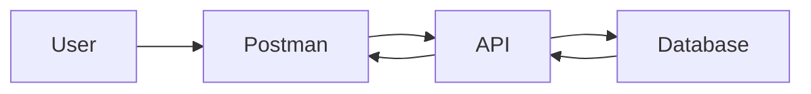
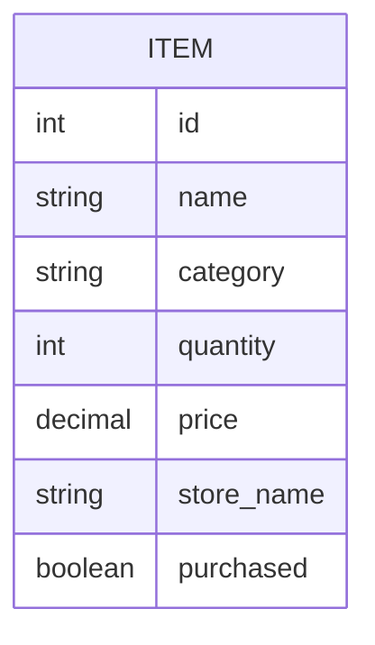

# 🛒 SmartCart Grocery Planner

## Milestone 3: Backend REST API

**Course:** CST-391 JavaScript Web Application Development  
**Author:** Doreen Rose  
**Date:** March 2026  

---

## Introduction

SmartCart Grocery Planner is a backend web application that helps users manage a grocery shopping list. Users can create, view, update, and delete grocery items through REST API endpoints. The backend is built with **Node.js**, **Express**, and **TypeScript**, and the data is stored in a **MySQL** relational database.

This milestone focuses on the backend services and shows how the API connects to MySQL and performs CRUD operations.

---

## Milestone 3 Goals

The purpose of this milestone is to design and build the backend REST APIs for SmartCart Grocery Planner. The application supports these main operations:

- Create grocery items
- Read grocery items
- Update grocery items
- Delete grocery items

The API is tested in **Postman**, and the database changes can be verified in **MySQL Workbench** or **MAMP**.

---

## Technology Stack

### Development Tools

- Visual Studio Code
- GitHub
- NPM
- Postman
- MySQL Workbench or MAMP

### Backend

- Node.js
- Express.js
- TypeScript
- MySQL

---

## Design Updates

The SmartCart Grocery Planner design stayed close to the Milestone 2 proposal. The main updates in this milestone were focused on turning the original API plan into working backend code.

### Summary of Updates

| Change | Description | Status |
|--------|-------------|--------|
| TypeScript backend added | Express backend built using TypeScript | Completed |
| MySQL connection added | Database connection configured with mysql2 | Completed |
| CRUD routes added | Create, Read, Update, Delete endpoints built | Completed |
| Validation added | Basic server-side validation for item input | Completed |
| Postman collection added | API requests prepared for testing | Completed |
| Frontend integration | Frontend is not included in this milestone | Pending |

---

## Application Architecture



### Explanation

1. The user sends requests through Postman.
2. The Express API receives the request.
3. The API runs SQL queries against MySQL.
4. The database returns data to the API.
5. The API sends a JSON response back to the user.

---

## Project Structure

```text
SmartCart_Milestone3_App_Submission
│
├── src
│   ├── app.ts
│   ├── server.ts
│   ├── config
│   │   └── db.ts
│   ├── controllers
│   │   └── itemController.ts
│   ├── dao
│   │   └── itemDao.ts
│   ├── middleware
│   │   └── validateItem.ts
│   ├── models
│   │   └── Item.ts
│   └── routes
│       └── itemRoutes.ts
│
├── database
│   └── schema.sql
│
├── postman
│   └── SmartCart_Milestone3_Postman_Collection.json
│
├── deliverables
│   ├── github_repo_link.txt
│   ├── screencast_link.txt
│   └── screencast_script.md
│
├── Milestone3_Presentation.pptx
├── package.json
├── tsconfig.json
├── .env.example
└── README.md
```

---

## REST API Design

### Base URL

```text
http://localhost:3000/api
```

### API Entry Points

| Method | Endpoint | Description |
|--------|----------|-------------|
| GET | /items | Get all grocery items |
| GET | /items/:id | Get one grocery item by ID |
| POST | /items | Create a new grocery item |
| PUT | /items/:id | Update an existing grocery item |
| DELETE | /items/:id | Delete a grocery item |

---

## Example Request Body

```json
{
  "name": "Eggs",
  "category": "Dairy",
  "quantity": 1,
  "price": 4.99,
  "store_name": "Fry's",
  "purchased": false
}
```

---

## Database Design



### Items Table

| Field | Type | Description |
|-------|------|-------------|
| id | INT | Unique item ID |
| name | VARCHAR(100) | Name of the grocery item |
| category | VARCHAR(50) | Item category |
| quantity | INT | Number of items needed |
| price | DECIMAL(10,2) | Estimated item price |
| store_name | VARCHAR(100) | Store name |
| purchased | BOOLEAN | Purchased status |

---

## How to Run the App

### 1. Install dependencies

```bash
npm install
```

### 2. Create your environment file

Copy `.env.example` to `.env` and update your database settings.

Example:

```env
PORT=3000
DB_HOST=localhost
DB_PORT=3306
DB_USER=root
DB_PASSWORD=root
DB_NAME=smartcartdb
```

### 3. Create the database

Open MySQL Workbench and run:

```sql
source database/schema.sql;
```

Or copy and paste the SQL from `database/schema.sql` into MySQL Workbench and run it.

### 4. Start the server

```bash
npm run dev
```

### 5. Test with Postman

Import the Postman collection from:

```text
postman/SmartCart_Milestone3_Postman_Collection.json
```

---

## Testing the API

Use Postman to test these operations:

### Read All Items

```http
GET http://localhost:3000/api/items
```

### Read One Item

```http
GET http://localhost:3000/api/items/1
```

### Create Item

```http
POST http://localhost:3000/api/items
```

### Update Item

```http
PUT http://localhost:3000/api/items/1
```

### Delete Item

```http
DELETE http://localhost:3000/api/items/1
```

---

## Challenges Encountered

Some challenges in this milestone included:

- Connecting Express to MySQL correctly
- Organizing the backend into routes, controllers, and DAO files
- Making sure request body data matched the database columns
- Testing each endpoint in Postman and confirming database changes

---

## Pending Bugs or Issues

Current known issues and future work include:

- No frontend is connected yet
- Authentication is not included in this milestone
- Validation is basic and can be improved
- Error messages can be expanded for more detail

---

## Lessons Learned

This milestone helped demonstrate how backend APIs work in a real web application. Important lessons learned include:

- How REST APIs connect the client and the database
- How to use Express and TypeScript together
- How SQL queries support CRUD operations
- How Postman helps test and document API endpoints
- How project organization makes backend code easier to understand

---

## Links

- https://drive.google.com/file/d/1yD3vtBLNywNu6laHiMNc2uzls-7G15py/view?usp=sharing
- https://github.com/Drose001/cst391/tree/main/milestone/milestone3/SmartCart

---

## License

This project was created for educational purposes for the **Grand Canyon University Software Development program**.
