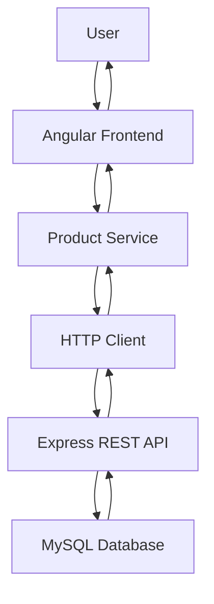
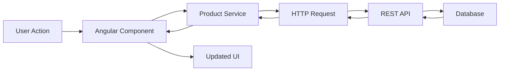
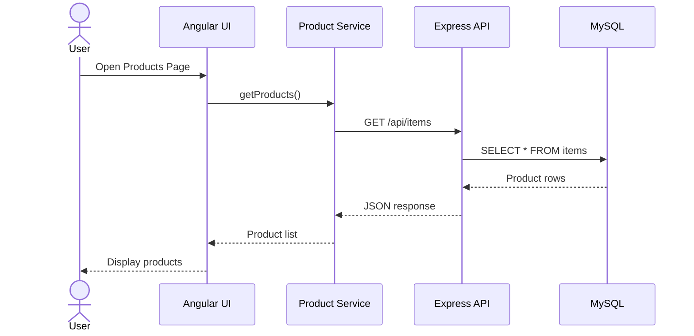
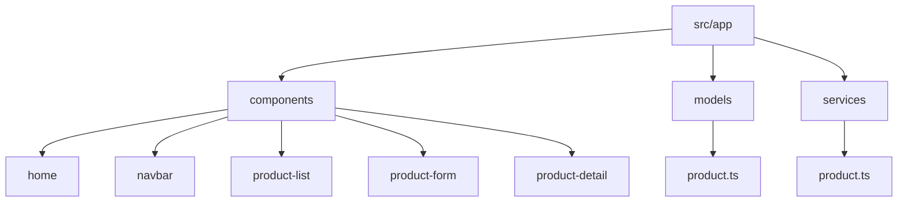

# 🛒 SmartCart Grocery Planner (Angular)

## 👩‍💻 Author
Doreen Rose  
Grand Canyon University  
Bachelor’s in Software Development  

---

## 📌 Overview
SmartCart is a front-end web application built using Angular that allows users to manage grocery items. The application connects to a REST API and supports full CRUD operations (Create, Read, Update, Delete).

---

## 🚀 Features
- View all grocery products
- Add new products
- Edit existing products
- Delete products
- View product details
- Responsive UI using Bootstrap
- Navigation with Angular Router

---

## 🛠️ Technologies Used
- Angular
- TypeScript
- HTML
- CSS
- Bootstrap
- Node.js
- Express
- MySQL

---

## 🏗️ Application Architecture

---

## 🔄 CRUD Interaction Flow

---

## ⏱️ Sequence Diagram

---

## 📂 Project Structure

---

## 🔗 API Integration

http://localhost:3000/api/items

---

## ▶️ Running the Application

### Install dependencies
npm install

### Run Angular
ng serve

### Open browser
http://localhost:4200

---

## 📸 Screenshots

### 🏠 Home Page

### 📋 Product List

### ➕ Add Product

### ✏️ Edit Product

### 🔍 Product Details

### ❌ Delete Confirmation

---

## ⚠️ Challenges
- Handling async API calls in Angular
- Fixing two-way binding using ngModel
- Managing data types (boolean vs number)
- Debugging PUT request validation errors

---

## 🐞 Known Issues
| Issue | Description |
|------|------------|
| Form validation | Minimal validation implemented |
| Error handling | Basic console logging |
| UI polish | Can be improved |

---

## 📚 Lessons Learned
- How Angular connects to REST APIs
- Using async/await with Observables
- Angular routing between components
- Debugging frontend and backend integration
- Managing application state

---

## 🎯 Conclusion
This project demonstrates a fully functional Angular front-end application integrated with a backend API. It successfully performs CRUD operations and provides a clean interface for managing grocery items.
