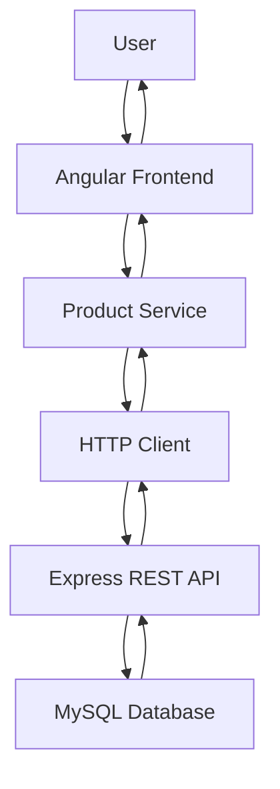
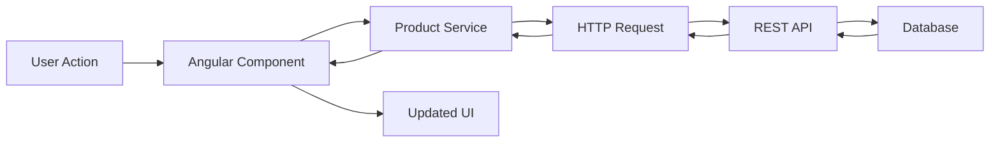
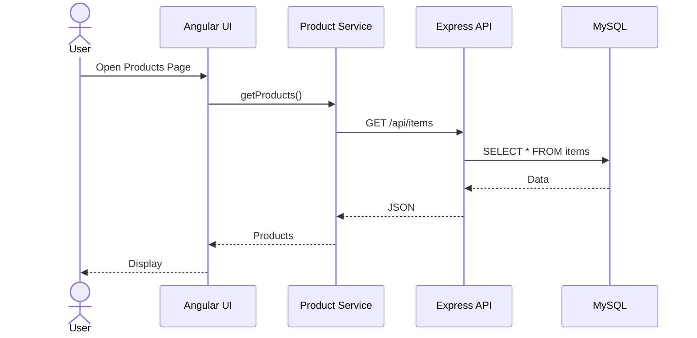
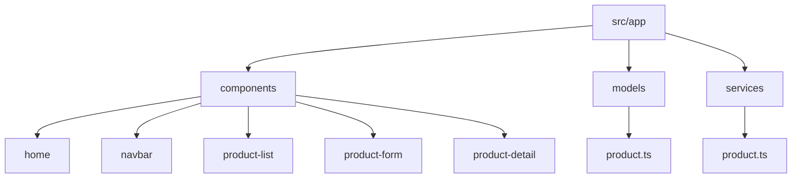
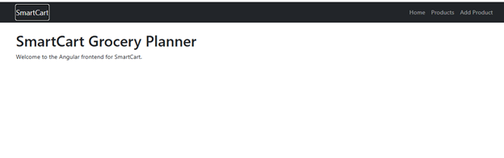
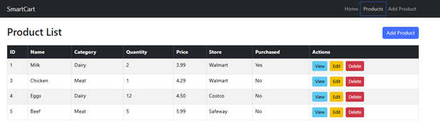
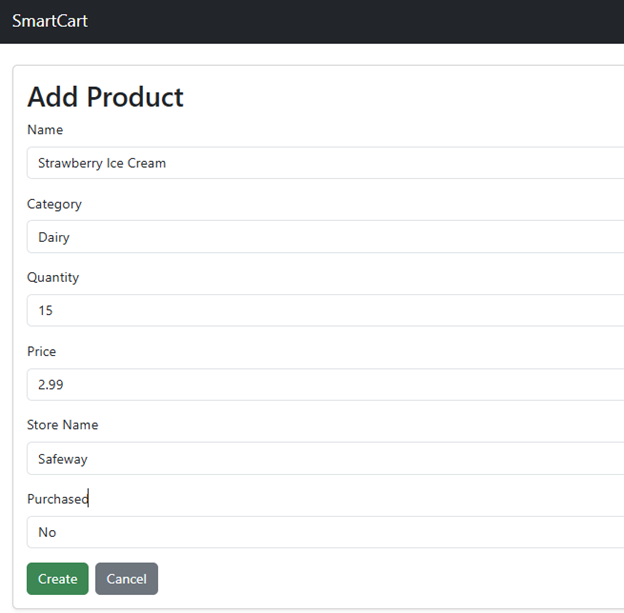
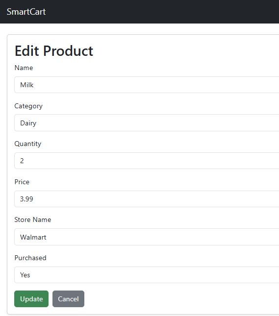
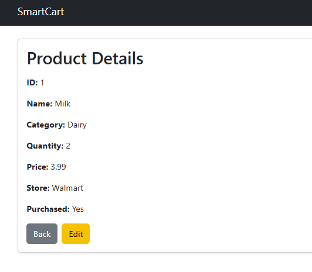
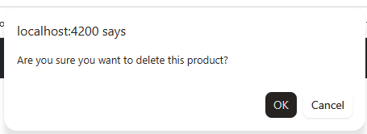

# 🛒 SmartCart Grocery Planner (Angular)

## 👩‍💻 Author
Doreen Rose  
Grand Canyon University  
Bachelor’s in Software Development  

---

## 📌 Overview
SmartCart is a front-end web application built using Angular that allows users to manage grocery items through a browser-based user interface. The application connects to a REST API developed with Node.js and Express, and the data is stored in a MySQL relational database.

The Angular frontend communicates with the backend API using HTTP requests. The backend processes the request and interacts with the database, then returns a JSON response that updates the user interface.

---

## 🚀 Features
- View all grocery products
- Add new products
- Edit existing products
- Delete products
- View product details
- Responsive UI using Bootstrap
- Navigation with Angular Router
- Integration with a REST API

---

## 🛠️ Technologies Used
- Angular
- TypeScript
- HTML
- CSS
- Bootstrap
- Node.js
- Express
- MySQL

---

## 🏗️ Application Architecture

### Explanation
This diagram shows how data flows through the system from user to database and back.

---

## 🔄 CRUD Interaction Flow

### Explanation
Each user action follows this path through the system.

---

## ⏱️ Sequence Diagram

---

## 📂 Project Structure

---

## 🔗 API Integration

http://localhost:3000/api/items

---

## ▶️ Running the Application

npm install  
ng serve  
http://localhost:4200  

---

## 📸 Screenshots

### 🏠 Home Page

**Caption:**  
This screenshot shows the Home Page of the SmartCart application. It serves as the landing page and provides basic information about the system. The navigation bar at the top allows users to move between different sections of the application, including Products and Add Product. This page demonstrates Angular routing and the overall layout of the user interface.

---

### 📋 Product List

**Caption:**  
This screenshot displays the Product List page, which retrieves all product records from the backend API and presents them in a structured table. Each row represents a product stored in the database. The table includes action buttons for viewing details, editing, and deleting products. This page demonstrates the Read operation and how Angular dynamically renders data from the API.

---

### ➕ Add Product

**Caption:**  
This screenshot shows the Add Product page, where users can enter information to create a new product. The form includes fields such as name, category, quantity, price, store name, and purchased status. When submitted, the application sends a POST request to the backend API. This demonstrates the Create operation and form handling using Angular’s two-way data binding.

---

### ✏️ Edit Product

**Caption:**  
This screenshot shows the Edit Product page. The form is pre-filled with data retrieved from the backend based on the selected product ID. Users can modify the values and submit the form to update the record. This demonstrates the Update operation and how Angular loads existing data into form controls using API calls.

---

### 🔍 Product Details

**Caption:**  
This screenshot displays the Product Details page, which shows detailed information about a single product. The data is retrieved using the product ID from the route parameter. This page demonstrates how Angular handles dynamic routing and displays a single record from the backend.

---

### ❌ Delete Confirmation

**Caption:**  
This screenshot shows the Delete Confirmation dialog that appears when a user attempts to remove a product. The confirmation ensures that the user does not accidentally delete important data. Once confirmed, a DELETE request is sent to the backend API and the product is removed from the database. This demonstrates the Delete operation and user interaction handling.

---

## 🎯 Conclusion
This project demonstrates a complete Angular frontend connected to a REST API performing full CRUD operations.

---

## Screencast
https://drive.google.com/file/d/1G7VO2xq0Tj26zrfYw-O0tm57gl_ymV4A/view
