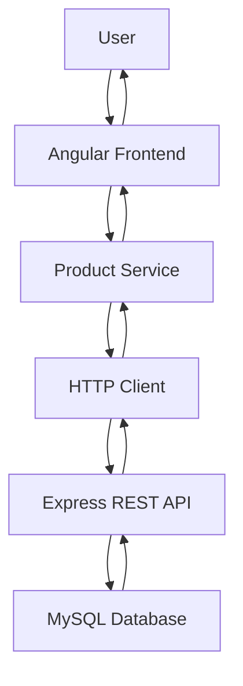
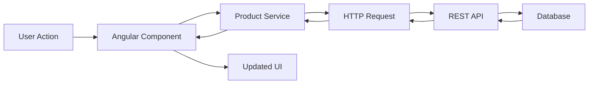
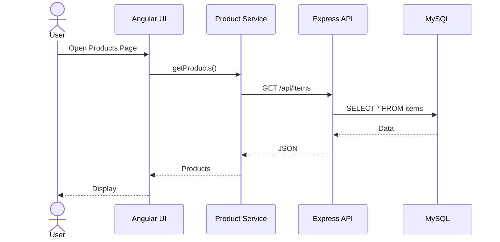
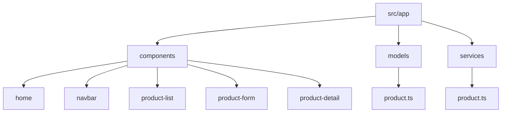

# 🛒 SmartCart Grocery Planner (Angular)

## 👩‍💻 Author
Doreen Rose  
Grand Canyon University  
Bachelor’s in Software Development  

---

## 📌 Overview
SmartCart is a front-end web application built using Angular that allows users to manage grocery items through a browser-based user interface. The application connects to a REST API developed with Node.js and Express, and the data is stored in a MySQL relational database.

The Angular frontend communicates with the backend API using HTTP requests. The backend processes the request and interacts with the database, then returns a JSON response that updates the user interface.

---

## 🚀 Features
- View all grocery products
- Add new products
- Edit existing products
- Delete products
- View product details
- Responsive UI using Bootstrap
- Navigation with Angular Router
- Integration with a REST API

---

## 🛠️ Technologies Used
- Angular
- TypeScript
- HTML
- CSS
- Bootstrap
- Node.js
- Express
- MySQL

---

## 🏗️ Application Architecture

### Explanation
This diagram shows how data flows through the system from user to database and back.

---

## 🔄 CRUD Interaction Flow

### Explanation
Each user action follows this path through the system.

---

## ⏱️ Sequence Diagram

---

## 📂 Project Structure

---

## 🔗 API Integration

http://localhost:3000/api/items

---

## ▶️ Running the Application

npm install  
ng serve  
http://localhost:4200  

---

## 📸 Screenshots

---

## 🎯 Conclusion
This project demonstrates a complete Angular frontend connected to a REST API performing full CRUD operations.

---

## Screencast
https://drive.google.com/file/d/1G7VO2xq0Tj26zrfYw-O0tm57gl_ymV4A/view
