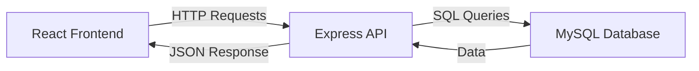
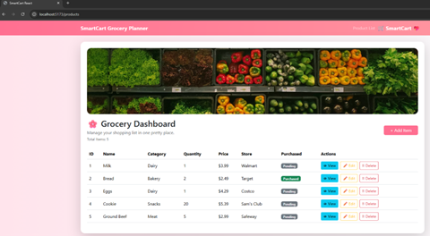
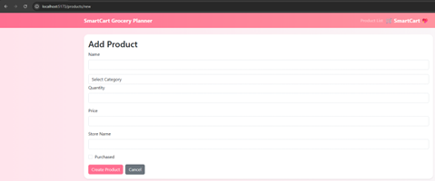
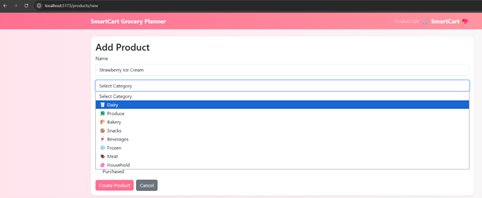
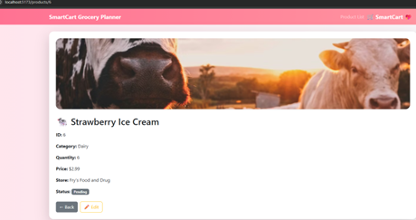
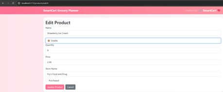
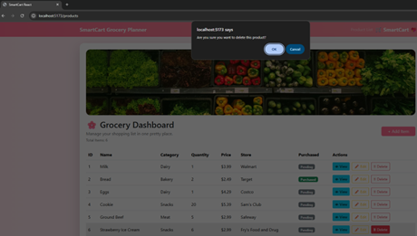
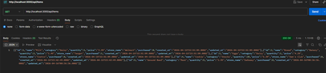
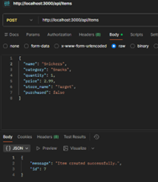

# 🛒 SmartCart Grocery Planner

## 📌 Overview
SmartCart Grocery Planner is a full-stack web application designed to help users efficiently manage grocery items. The application supports full CRUD (Create, Read, Update, Delete) functionality and integrates a React frontend with an Express/Node.js backend connected to a MySQL database.

This project demonstrates real-world full-stack architecture, REST API communication, and user-focused interface design.

---

## 🚀 Features

- 📦 View all grocery items in a dashboard  
- ➕ Add new items with structured input  
- ✏️ Edit existing items with pre-filled data  
- 👁 View detailed product information  
- 🗑 Delete items with confirmation  
- 🧠 Category-based organization  
- 🎯 Dropdown-based category selection (data consistency)  
- 🖼 Dynamic category-based images  
- 💖 Styled UI with responsive design  

---

## 🧱 Tech Stack

### Frontend
- React (Vite)
- React Router DOM
- Bootstrap

### Backend
- Node.js
- Express
- TypeScript
- REST API

### Database
- MySQL (MAMP)

---

## 🔗 System Architecture

---

## 📡 API Endpoints

| Method | Endpoint              | Description             |
|--------|----------------------|-------------------------|
| GET    | /api/items           | Get all items           |
| GET    | /api/items/:id       | Get single item         |
| POST   | /api/items           | Create new item         |
| PUT    | /api/items/:id       | Update item             |
| DELETE | /api/items/:id       | Delete item             |

---

## 📸 Screenshots

### 🖥 Dashboard  
  
*Figure 1: SmartCart dashboard displaying all grocery items retrieved from the database, including category classification, pricing, store information, and purchase status indicators.*

---

### ➕ Add Product (Empty Form)  
  
*Figure 2: Product creation form providing structured input fields for user data entry, including name, category, quantity, price, and store information.*

---

### 🧾 Add Product (Dropdown Categories)  
  
*Figure 3: Enhanced product form utilizing a dropdown category selection to enforce data consistency and improve user experience.*

---

### 👁 Product Detail  
  
*Figure 4: Detailed product view displaying item-specific information along with dynamically rendered category-based imagery and purchase status indicators.*

---

### ✏️ Edit Product  
  
*Figure 5: Edit product form with pre-populated fields, allowing users to update existing records while maintaining data integrity.*

---

### 🗑 Delete Confirmation  
  
*Figure 6: Confirmation dialog prompting the user to verify deletion, ensuring safe removal of data and preventing accidental actions.*

---

### 📡 API GET (Postman)  
  
*Figure 7: GET request executed in Postman retrieving all product records in JSON format from the backend API.*

---

### 📡 API POST (Postman)  
  
*Figure 8: POST request in Postman demonstrating successful creation of a new product record via the REST API, confirming backend functionality.*

---

## 🎥 Screencast

📺 Demo Video:  
https://drive.google.com/file/d/1Y8TbIHtisL3pbPGlK2TkEE8bi4RJ9wYM/view?usp=sharing 

---

## 🧠 Design Decisions

- Implemented dropdown-based category selection to enforce data consistency  
- Used dynamic image rendering based on category for improved UX  
- Applied responsive design principles using Bootstrap  
- Followed RESTful API design for backend communication  

---

## 🚧 Challenges

- Configuring MySQL connection using environment variables  
- Resolving frontend-backend connectivity issues  
- Handling asynchronous API calls in React  
- Ensuring consistent category mapping across UI and backend  

---

## 📈 Future Improvements

- User authentication system  
- Search and filtering functionality  
- Cloud deployment  
- Mobile optimization  

---

## 🎯 Conclusion

SmartCart Grocery Planner successfully demonstrates a complete full-stack application with real-world functionality. The project highlights strong frontend-backend integration, database management, and user-centered design.

This application reflects industry-standard practices and showcases readiness for professional software development roles.

---

##  Author

- Doreen Rose  
